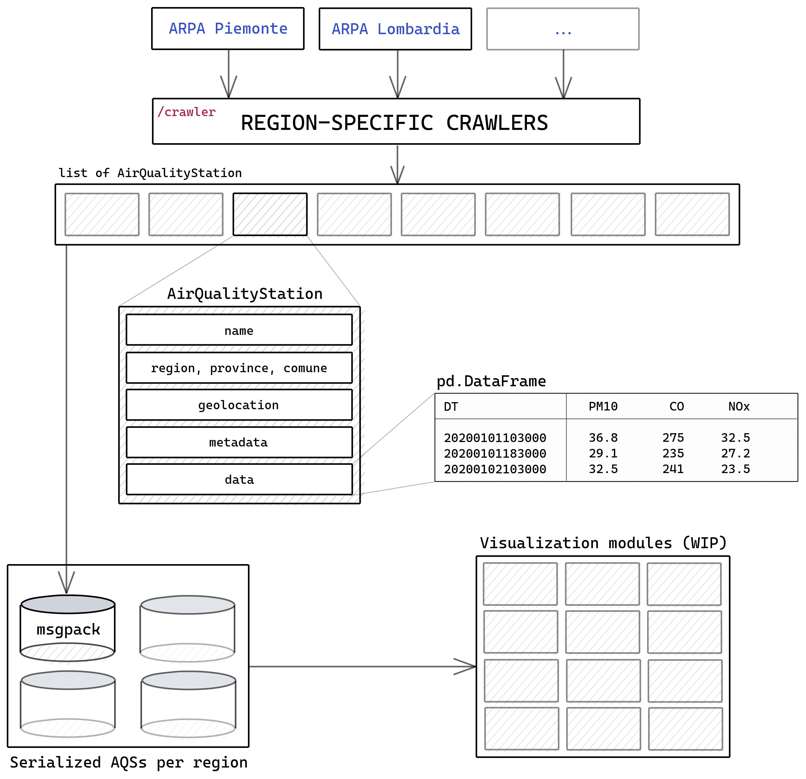

# Italy Air Quality Aggregator (ITAQA)

<a href="https://github.com/albertosantagostino/ITAQA-air-quality-aggregator/commits/master" target="\_parent"></a> <a href="https://github.com/albertosantagostino/ITAQA-air-quality-aggregator/issues" target="\_parent"></a>


**ITAQA** is a framework that **aggregates** Italy air quality data, collecting automatically measurements from different sources. It provides scripts and utilities to query data, analyze it and create interactive graphs

### The question that sparked this project

ITAQA was created in the beginning of 2020 to answer this question:

> As a consequence of the [COVID-19 pandemic in Italy](https://en.wikipedia.org/wiki/2020_coronavirus_pandemic_in_Italy), will there be a measurable **effect on the air pollution** due to the abrupt lifestyle change (more people working from home, less traffic) after the [enforcement of lockdowns](https://en.wikipedia.org/wiki/COVID-19_pandemic_lockdown_in_Italy)? If yes, can this reduction be correlated with precision to these measures?

To verify this conjecture it would be preferable to have a single uniform data set to use as input

The main providers of pollution data in Italy are **ARPA** agencies, (*Agenzie Regionali per la Protezione Ambientale*). Unfortunately, they are **regional** agency, providing data only for their region of competence (meaning 21 different agencies, providing data in different formats)

The main purpose of ITAQA is to automatically download and aggregate national air pollution data in an **uniform and accessible way**, providing data analysis tools

(You can read more on ITAQA's origin in [this post](https://albertosantagostino.github.io/blog/2020/05/29/ITAQA_introduction_en))

## Objectives

* Create a single place to orchestrate the download of pollution data for all Italy regions (from ARPA websites) and to aggregate the collected data in an uniform data structure (the same for every region) that can be saved/loaded quickly
* Create a tool to plot pollution data, able also to create intuitive visualizations/comparison between regions
* Search correlation between big "behavior-changing" events and air pollution
* Make the entire framework usable also by non-technical users (GUI creation)

## Usage

#### Technical overview

The core concepts of ITAQA are:

* **AirQualityStation** (or **AQS**) objects: single sensors holding time indexed pollution data for specific locations
* **AirQualityStationCollection** (or **AQSC**) objects: collections of **AQS** easy to update, save, query
* **Crawlers**: scripts that obtain pollution data for a specific region and time, downloading and aggregating it from ARPA websites directly into **AQSC**

#### Installation

Clone the repository (`git clone git@github.com:albertosantagostino/ITAQA-air-quality-aggregator.git`), check that you have Python 3.8 (`python --version`) and install all the needed packages (directly via `poetry install`, refer to [Poetry's documentation](https://python-poetry.org/docs/basic-usage/#installing-dependencies))

#### Invocation

The main entrypoint is the script `itaqa.py`. Run it using the `-h` parameter to see the built-in help

```
itaqa.py [MODE] [parameters] [-h]
```

**Available modes**  

```
download            Download new data, save the AQSC in dump/REGION/
update              Update existing AQS collection with new data
view                Enter interactive GUI mode to view and plot AQS data
test                Run unit tests (pytest)
sandbox             Run sandbox
```
#### Example

If you want to perform a data download to check if everything is working, you can perform the following steps:

**Data download**  
Download data from Lombardia for the first month of 2020:  

```
python3 itaqa.py download --region lombardia --min_date 20200101 --max_date 20200201  
```

The message _"Download completed!"_ indicates the successful download and serialization of all the requested data. Air quality information for the specified period has been stored in a AQSC object (a special collection that encapsulates multiple AQS, saved as a `.msgpack` file)

**Data analysis and visualization**  
While ITAQA is currently meant for developers, a basic GUI to explore and view data is ready to be used. Start the GUI with the command:

```
python3 itaqa.py view
```
Select the folder where the data is stored to see the AQS objects contained. Select and plot the desired ones using the correspondent button.

As an alternative, data can be loaded and explored directly editing the sandbox section of `itaqa.py`, and invoking the main script in this way:

```
python3 itaqa.py sandbox
```

## Architecture
<p align="center">
  
</p>

## FAQ

**Why make this? There are already air quality websites that collect this kind of data**

> First of all: there is no public place (as far as I know) where air pollution data is collected in an uniform way for the entire country  
> The main use case is to investigate the thesis above ("*Did the lockdown have a measurable effect on air quality? In what measure?"*), meaning that I want to produce plots where this correlation is clearly visible  
> Nevertheless, the aim of this project is broader: create a set of reusable air quality analysis tools that unify all sources from the regions of Italy

**You said ARPAs provide data in different formats. Why?**

> I assume that each ARPA can decide how to handle and distribute data to the public and unfortunately it seems they never talked to each other  
> Even the websites are all completely different ([ARPA Piemonte](http://www.arpa.piemonte.it/) vs [ARPA Lombardia](https://www.arpalombardia.it/Pages/ARPA_Home_Page.aspx) vs [ARPA Emilia-Romagna](https://www.arpae.it/) vs [ARPA Toscana](www.arpat.toscana.it))  
> _Maybe_ there is some "internal uniform data format" they use to exchange data, but if it exists, is not available to the public

**Do you plan to publish visualizations/plots produced? Where?**

> Yes! As soon as I have something worth showing, I will write an article in [my blog](https://albertosantagostino.github.io/)

**Can I contribute? What could I do?**

> Yes! Refer to [CONTRIBUTING](CONTRIBUTING.md) to find all the needed information (setup, developer environment, workflow)  
> The main thing that needs heavy work right now is the creation of region-specific crawlers. Right now only a couple of them are fully implemented. Refer to the table below to see the status

## ARPA Websites

| **Region**                                                   | ARPA Website                                                 | Simple crawler | Complete AQSC |
| ------------------------------------------------------------ | ------------------------------------------------------------ | -------------- | ------------- |
| [Abruzzo](http://www.comuni-italiani.it/13/index.html)       | [ARTA Abruzzo](https://www.artaabruzzo.it/)                  |                |               |
| [Basilicata](http://www.comuni-italiani.it/17/index.html)    | [ARPA Basilicata](http://www.arpab.it/)                      |                |               |
| [Calabria](http://www.comuni-italiani.it/18/index.html)      | [ARPA Calabria](http://www.arpacampania.it/)                 |                |               |
| [Campania](http://www.comuni-italiani.it/15/index.html)      | [ARPA Campania](http://www.arpacampania.it/)                 |                |               |
| [Emilia-Romagna](http://www.comuni-italiani.it/08/index.html) | [ARPA Emilia-Romagna](https://www.arpae.it/)                 | ✔️              |               |
| [Friuli-Venezia Giulia](http://www.comuni-italiani.it/06/index.html) | [ARPA Friuli-Venezia-Giulia](http://www.arpa.fvg.it/cms/)    |                |               |
| [Lazio](http://www.comuni-italiani.it/12/index.html)         | [ARPA Lazio](http://www.arpalazio.gov.it/)                   |                |               |
| [Liguria](http://www.comuni-italiani.it/07/index.html)       | [ARPA Liguria](https://www.arpal.liguria.it/)                |                |               |
| [Lombardia](http://www.comuni-italiani.it/03/index.html)     | [ARPA Lombardia](https://www.arpalombardia.it/Pages/ARPA_Home_Page.aspx) | ✔️              | ✔️             |
| [Marche](http://www.comuni-italiani.it/11/index.html)        | [ARPA Marche](https://www.arpa.marche.it/)                   |                |               |
| [Molise](http://www.comuni-italiani.it/14/index.html)        | [ARPA Molise](http://www.arpamolise.it/)                     |                |               |
| [Piemonte](http://www.comuni-italiani.it/01/index.html)      | [ARPA Piemonte](http://www.arpa.piemonte.it/)                | ✔️              |               |
| [Puglia](http://www.comuni-italiani.it/16/index.html)        | [ARPA Puglia](http://www.arpa.puglia.it/web/guest/arpa_home) |                |               |
| [Sardegna](http://www.comuni-italiani.it/20/index.html)      | [ARPA Sardegna](http://www.sardegnaambiente.it/arpas/)       |                |               |
| [Sicilia](http://www.comuni-italiani.it/19/index.html)       | [ARPA Sicilia](https://www.arpa.sicilia.it/)                 |                |               |
| [Toscana](http://www.comuni-italiani.it/09/index.html)       | [ARPA Toscana](http://www.arpat.toscana.it/)                 |                |               |
| [Trentino-Alto Adige](http://www.comuni-italiani.it/04/index.html) | [APPA Trento](http://www.appa.provincia.tn.it/) / [Ambiente Bolzano](https://ambiente.provincia.bz.it/) |                |               |
| [Umbria](http://www.comuni-italiani.it/10/index.html)        | [ARPA Umbria](http://www.arpa.umbria.it/)                    |                |               |
| [Valle d'Aosta](http://www.comuni-italiani.it/02/index.html) | [ARPA Valle d'Aosta](https://www.arpa.vda.it/it)             |                |               |
| [Veneto](http://www.comuni-italiani.it/05/index.html)        | [ARPA Veneto](https://www.arpa.veneto.it/)                   |                |               |

## License

This project and its source code are distributed under the [GNU General Public License v3.0](https://choosealicense.com/licenses/gpl-3.0/)
