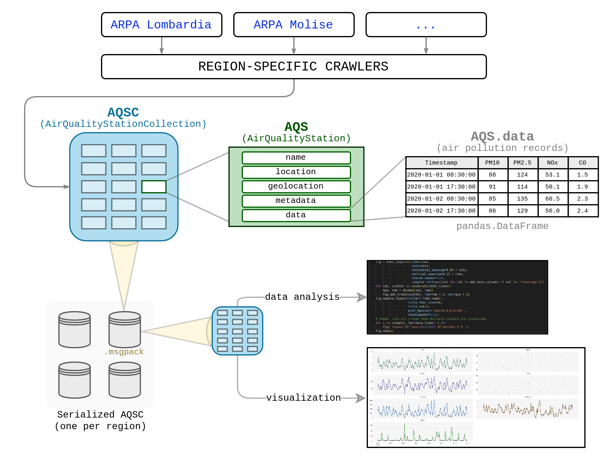

# Italy Air Quality Aggregator (ITAQA)

This project aims to build a set of tools to facilitate analysis of air quality in Italy collecting automatically data from different sources and providing a framework to create visualizations

### The "question" that sparked this project

The idea of collecting and measuring air pollution in this period of time originated from this question/idea:

> As a consequence of the SARS-CoV-2 outbreak in Italy ([Wikipedia link](https://en.wikipedia.org/wiki/2020_coronavirus_pandemic_in_Italy)), will there be a measurable **effect on the air pollution** in the affected region(s) due to the "more people working from home therefore **less traffic**" effect? And if yes, will it be "synced" with the different level of "quarantine" decided/imposed by the Italian government in these weeks/months? If yes, in which way?

## Rationale

* Have a single entrypoint from which orchestrate the download of data from different Italy regions and sources (mostly **ARPA** websites)
  * ARPA websites are unfortunately a lot different among the various regions (see websites of [ARPA Piemonte](http://www.arpa.piemonte.it/) vs [ARPA Lombardia](https://www.arpalombardia.it/Pages/ARPA_Home_Page.aspx) vs [ARPA Emilia-Romagna](https://www.arpae.it/), for example)
    As  far as I know there is not a single point to collect pollution data from all the measurement stations on the whole country with a "single API call"
  * Below you can find a list of all ARPA websites, for all Italy's regions
* Build a module to graphically visualize data and history of pollutants in different areas of the country
* Search correlation between big "behavior-changing" events and air pollution

## Architecture

## FAQ

_Fromnobody Answered Questions_

**Why make this project? Why not reuse one of the already existing air quality plots and websites?**

> The first use case is to prove/disprove the thesis above. Nevertheless, the aim of this project is broader: create a set of reusable air quality analysis tools that unify all different sources from Italy's regions

**There is already an air quality/pollution aggregator, you can find it and use it at this link...**

> Nice! But I didn't check if this thing was already existing, because if I do this all the time, I wouldn't get any projects done :) I'm also developing this as a personal project, to learn stuff, not only to "plot a graph and that's it"

**What are these regional "ARPA"?**

> These are *"Agenzie Regionali per la Protezione Ambientale"* (*Regional Environmental Protection Agency*), Italian governmental agencies that collect and analyze data on air, water, acoustic and soil pollution on the national territory

**Can I contribute?**

> Yes, of course, as soon as the project is structured enough. After that I will upload a CONTRIBUTING file.
> (Right now I have zero expectations on the final state of the project, I don't even know why I'm writing a FAQ section, but nevertheless this repository is and will stay public)

## ARPA Websites

| **Region**                                                   | ARPA Website                                                 | Data crawler | Data parser |
| ------------------------------------------------------------ | ------------------------------------------------------------ | ------------ | ----------- |
| [Abruzzo](http://www.comuni-italiani.it/13/index.html)       | [ARTA Abruzzo](https://www.artaabruzzo.it/)                  |              |             |
| [Basilicata](http://www.comuni-italiani.it/17/index.html)    | [ARPA Basilicata](http://www.arpab.it/)                      |              |             |
| [Calabria](http://www.comuni-italiani.it/18/index.html)      | [ARPA Calabria](http://www.arpacampania.it/)                 |              |             |
| [Campania](http://www.comuni-italiani.it/15/index.html)      | [ARPA Campania](http://www.arpacampania.it/)                 |              |             |
| [Emilia-Romagna](http://www.comuni-italiani.it/08/index.html) | [ARPA Emilia-Romagna](https://www.arpae.it/)                 |              |             |
| [Friuli-Venezia Giulia](http://www.comuni-italiani.it/06/index.html) | [ARPA Friuli-Venezia-Giulia](http://www.arpa.fvg.it/cms/)    |              |             |
| [Lazio](http://www.comuni-italiani.it/12/index.html)         | [ARPA Lazio](http://www.arpalazio.gov.it/)                   |              |             |
| [Liguria](http://www.comuni-italiani.it/07/index.html)       | [ARPA Liguria](https://www.arpal.liguria.it/)                |              |             |
| [Lombardia](http://www.comuni-italiani.it/03/index.html)     | [ARPA Lombardia](https://www.arpalombardia.it/Pages/ARPA_Home_Page.aspx) | ❕WIP         |             |
| [Marche](http://www.comuni-italiani.it/11/index.html)        | [ARPA Marche](https://www.arpa.marche.it/)                   |              |             |
| [Molise](http://www.comuni-italiani.it/14/index.html)        | [ARPA Molise](http://www.arpamolise.it/)                     |              |             |
| [Piemonte](http://www.comuni-italiani.it/01/index.html)      | [ARPA Piemonte](http://www.arpa.piemonte.it/)                | ✔️ (PM10)     |             |
| [Puglia](http://www.comuni-italiani.it/16/index.html)        | [ARPA Puglia](http://www.arpa.puglia.it/web/guest/arpa_home) |              |             |
| [Sardegna](http://www.comuni-italiani.it/20/index.html)      | [ARPA Sardegna](http://www.sardegnaambiente.it/arpas/)       |              |             |
| [Sicilia](http://www.comuni-italiani.it/19/index.html)       | [ARPA Sicilia](https://www.arpa.sicilia.it/)                 |              |             |
| [Toscana](http://www.comuni-italiani.it/09/index.html)       | [ARPA Toscana](http://www.arpat.toscana.it/)                 |              |             |
| [Trentino-Alto Adige](http://www.comuni-italiani.it/04/index.html) | [APPA Trento](http://www.appa.provincia.tn.it/) / [Ambiente Bolzano](https://ambiente.provincia.bz.it/) |              |             |
| [Umbria](http://www.comuni-italiani.it/10/index.html)        | [ARPA Umbria](http://www.arpa.umbria.it/)                    |              |             |
| [Valle d'Aosta](http://www.comuni-italiani.it/02/index.html) | [ARPA Valle d'Aosta](https://www.arpa.vda.it/it)             |              |             |
| [Veneto](http://www.comuni-italiani.it/05/index.html)        | [ARPA Veneto](https://www.arpa.veneto.it/)                   |              |             |

## License

This project and its source code are distributed under the [GNU General Public License v3.0](https://choosealicense.com/licenses/gpl-3.0/)

